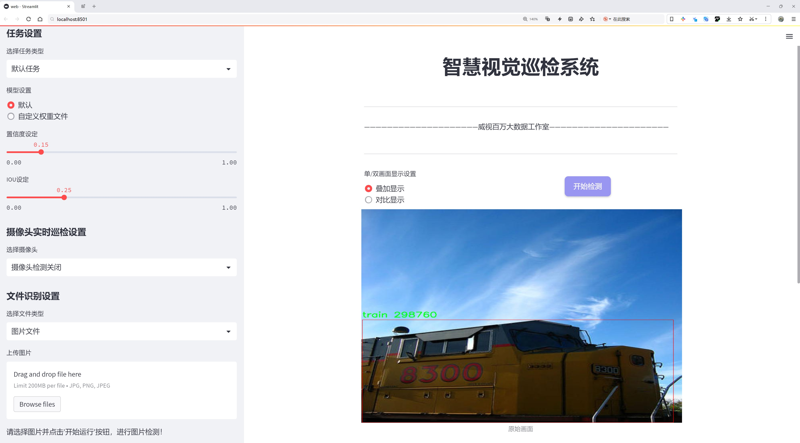
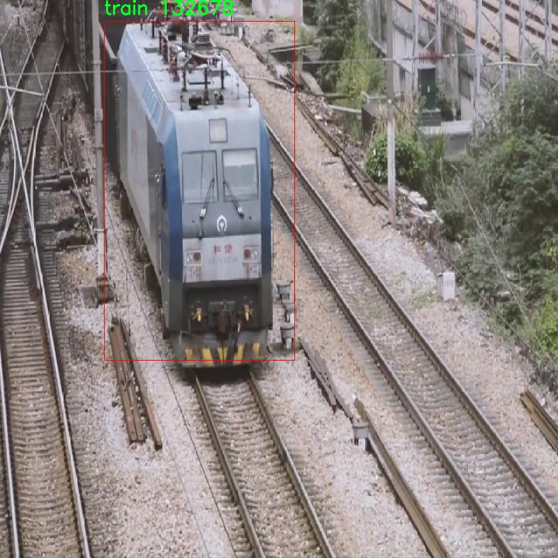

# 火车车厢检测检测系统源码分享
 # [一条龙教学YOLOV8标注好的数据集一键训练_70+全套改进创新点发刊_Web前端展示]

### 1.研究背景与意义

项目参考[AAAI Association for the Advancement of Artificial Intelligence](https://gitee.com/qunmasj/projects)

项目来源[AACV Association for the Advancement of Computer Vision](https://kdocs.cn/l/cszuIiCKVNis)

研究背景与意义

随着城市化进程的加快，铁路运输作为一种高效、环保的交通方式，越来越受到重视。火车在现代交通系统中扮演着至关重要的角色，尤其是在货物运输和人员流动方面。然而，火车车厢的安全监测与管理仍然面临诸多挑战。传统的监测手段往往依赖人工巡检，效率低下且容易出现漏检、误检等问题。因此，基于计算机视觉的自动化检测系统应运而生，成为提升火车车厢检测效率与准确性的有效解决方案。

近年来，深度学习技术的迅猛发展为目标检测领域带来了新的机遇。YOLO（You Only Look Once）系列模型因其高效的实时检测能力而广泛应用于各类目标检测任务。YOLOv8作为该系列的最新版本，结合了更为先进的网络结构和优化算法，具有更强的特征提取能力和更快的推理速度。然而，针对特定应用场景，如火车车厢检测，YOLOv8的性能仍有提升空间。因此，改进YOLOv8以适应火车车厢检测的需求，具有重要的研究意义。

本研究基于“train-railway”数据集，包含1700张火车车厢的图像，旨在通过改进YOLOv8模型，提升火车车厢的检测精度和速度。该数据集专注于单一类别“train”，为模型的训练和测试提供了良好的基础。通过对数据集的深入分析，可以发现火车车厢在不同环境、光照条件和角度下的多样性，这为模型的鲁棒性提出了更高的要求。因此，研究如何在保证检测准确率的同时，提高模型对复杂场景的适应能力，将是本研究的重要任务。

此外，火车车厢检测系统的成功应用不仅能够提高铁路运输的安全性，还能为智能交通系统的建设提供重要支持。通过自动化检测，能够实时监控火车车厢的状态，及时发现潜在的安全隐患，从而降低事故发生的风险。同时，该系统的推广应用将推动铁路行业的数字化转型，提高运营效率，降低人力成本。

综上所述，基于改进YOLOv8的火车车厢检测系统的研究，不仅具有重要的理论价值，也具有广泛的应用前景。通过本研究，期望能够为火车车厢的智能监测提供新的思路和方法，推动铁路运输的安全管理和智能化发展，为构建更加安全、高效的现代交通体系贡献力量。

### 2.图片演示




##### 注意：由于此博客编辑较早，上面“2.图片演示”和“3.视频演示”展示的系统图片或者视频可能为老版本，新版本在老版本的基础上升级如下：（实际效果以升级的新版本为准）

  （1）适配了YOLOV8的“目标检测”模型和“实例分割”模型，通过加载相应的权重（.pt）文件即可自适应加载模型。

  （2）支持“图片识别”、“视频识别”、“摄像头实时识别”三种识别模式。

  （3）支持“图片识别”、“视频识别”、“摄像头实时识别”三种识别结果保存导出，解决手动导出（容易卡顿出现爆内存）存在的问题，识别完自动保存结果并导出到tempDir中。

  （4）支持Web前端系统中的标题、背景图等自定义修改，后面提供修改教程。

  另外本项目提供训练的数据集和训练教程,暂不提供权重文件（best.pt）,需要您按照教程进行训练后实现图片演示和Web前端界面演示的效果。

### 3.视频演示

[3.1 视频演示](https://www.bilibili.com/video/BV15oxjeFEc6/)

### 4.数据集信息展示

##### 4.1 本项目数据集详细数据（类别数＆类别名）

nc: 1
names: ['train']


##### 4.2 本项目数据集信息介绍

数据集信息展示

在现代计算机视觉领域，数据集的质量和多样性直接影响到模型的训练效果和最终性能。为此，本研究采用了名为“train-railway”的数据集，旨在改进YOLOv8的火车车厢检测系统。该数据集专门针对火车车厢的检测任务进行了精心设计，包含了丰富的图像数据，能够有效支持模型的训练和验证。

“train-railway”数据集的类别数量为1，具体类别为“train”。这一设计体现了数据集的专一性和针对性，确保了模型在特定任务上的高效学习。通过聚焦于单一类别，研究者能够深入挖掘该类别的特征，从而提高模型的检测精度。在火车车厢检测的场景中，火车车厢的外观、形状、颜色以及在不同环境下的表现都可能存在显著差异，因此，数据集中的图像需要涵盖多种不同的拍摄角度、光照条件和背景环境，以增强模型的泛化能力。

数据集中的图像经过精心挑选和标注，确保每一张图像都能为模型提供有效的学习信息。标注的准确性是影响模型性能的关键因素之一，因此在数据集构建过程中，专业的标注团队对每一张图像进行了仔细的审核和标注，确保每个火车车厢都被准确框定。这种高质量的标注不仅有助于模型的训练，也为后续的模型评估提供了可靠的基准。

在数据集的构建过程中，考虑到了多样性和代表性。数据集中的图像来自不同的火车类型和运营环境，包括城市轨道交通、长途列车和货运列车等。这种多样性使得模型能够学习到不同类型火车车厢的特征，从而在实际应用中具备更强的适应能力。此外，数据集还包含了在不同天气条件下拍摄的图像，如晴天、雨天和雾天等，进一步增强了模型在复杂环境下的鲁棒性。

为了便于模型的训练和评估，数据集还划分了训练集和验证集。训练集用于模型的学习，而验证集则用于评估模型的性能和调优超参数。这种划分策略能够有效防止模型的过拟合现象，确保模型在未见数据上的表现同样出色。

总之，“train-railway”数据集为改进YOLOv8的火车车厢检测系统提供了坚实的基础。通过高质量的图像和准确的标注，该数据集不仅提升了模型的检测精度，也为后续的研究和应用奠定了良好的基础。随着火车运输行业的不断发展，火车车厢检测技术的提升将为安全监控、运营管理和智能交通系统的建设提供重要支持，而“train-railway”数据集的应用无疑将为这一目标的实现贡献力量。




### 5.全套项目环境部署视频教程（零基础手把手教学）

[5.1 环境部署教程链接（零基础手把手教学）](https://www.ixigua.com/7404473917358506534?logTag=c807d0cbc21c0ef59de5)


[5.2 安装Python虚拟环境创建和依赖库安装视频教程链接（零基础手把手教学）](https://www.ixigua.com/7404474678003106304?logTag=1f1041108cd1f708b01a)

### 6.手把手YOLOV8训练视频教程（零基础小白有手就能学会）

[6.1 手把手YOLOV8训练视频教程（零基础小白有手就能学会）](https://www.ixigua.com/7404477157818401292?logTag=d31a2dfd1983c9668658)

### 7.70+种全套YOLOV8创新点代码加载调参视频教程（一键加载写好的改进模型的配置文件）

[7.1 70+种全套YOLOV8创新点代码加载调参视频教程（一键加载写好的改进模型的配置文件）](https://www.ixigua.com/7404478314661806627?logTag=29066f8288e3f4eea3a4)

### 8.70+种全套YOLOV8创新点原理讲解（非科班也可以轻松写刊发刊，V10版本正在科研待更新）

由于篇幅限制，每个创新点的具体原理讲解就不一一展开，具体见下列网址中的创新点对应子项目的技术原理博客网址【Blog】：


[8.1 70+种全套YOLOV8创新点原理讲解链接](https://gitee.com/qunmasj/good)

### 9.系统功能展示（检测对象为举例，实际内容以本项目数据集为准）

图9.1.系统支持检测结果表格显示

  图9.2.系统支持置信度和IOU阈值手动调节

  图9.3.系统支持自定义加载权重文件best.pt(需要你通过步骤5中训练获得)

  图9.4.系统支持摄像头实时识别

  图9.5.系统支持图片识别

  图9.6.系统支持视频识别

  图9.7.系统支持识别结果文件自动保存

  图9.8.系统支持Excel导出检测结果数据


### 10.原始YOLOV8算法原理

原始YOLOv8算法原理

YOLOv8（You Only Look Once version 8）作为YOLO系列的最新模型，代表了目标检测领域的一次重要进步。其设计理念在于实现高效、实时的目标检测，同时克服以往模型在复杂环境下的局限性。YOLOv8在算法架构上进行了多项创新，尤其是在特征提取、特征融合和目标检测策略等方面，显著提升了检测精度和速度。

YOLOv8的网络结构主要由四个核心模块组成：输入端、主干网络、Neck端和输出端。输入端负责对输入图像进行预处理，包括Mosaic数据增强、自适应图像缩放和灰度填充等操作。这些预处理步骤旨在增强模型对多样化输入的适应能力，提升其在不同场景下的表现。主干网络则是YOLOv8的特征提取核心，采用了CSPDarknet结构，将特征提取过程分为多个分支，利用C2f模块替代了YOLOv5中的C3模块，显著提升了特征提取的效率和效果。C2f模块通过对输入特征图进行分支处理，使得每个分支都能独立提取特征，最终通过卷积层进行融合，形成更高维度的特征图，从而增强了模型的梯度流信息。

在特征融合方面，YOLOv8引入了基于PAN（Path Aggregation Network）结构的Neck端设计，通过上采样和下采样操作，将不同尺度的特征图进行有效融合。这种多尺度特征融合的策略，使得YOLOv8能够在不同大小的目标检测中表现出色，尤其是在处理小目标时，提升了其检测能力。Neck端的设计不仅提高了特征的利用率，还通过Slim-neck和GSConv等技术，降低了计算量，确保了模型在实时检测中的高效性。

YOLOv8的输出端采用了decoupled head结构，成功实现了分类和回归过程的解耦。这一创新使得模型在处理正负样本匹配时，能够更加灵活和高效。通过Task-Aligned Assigner方法，YOLOv8对分类分数和回归分数进行了加权处理，从而优化了正样本的匹配效果。在损失计算方面，YOLOv8采用了BCE（Binary Cross-Entropy）损失函数计算分类损失，并结合DFL（Distribution Focal Loss）和CIoU（Complete Intersection over Union）损失函数进行回归损失的计算。这种多样化的损失函数设计，进一步提升了模型的泛化能力和精准度。

值得注意的是，YOLOv8在目标检测策略上采用了无锚框（Anchor-Free）的方法，这一创新使得模型在目标定位时不再依赖于预设的锚框，而是直接预测目标的中心点及其宽高比例。这种方式不仅减少了锚框的数量，还提高了检测速度和准确度，尤其在复杂背景下的表现更为突出。

尽管YOLOv8在许多方面都取得了显著的进展，但在特定的复杂环境下，仍然存在一些挑战。例如，在复杂水面环境中，由于小目标漂浮物的特征复杂且背景多样，YOLOv8在目标定位和感知能力上可能出现不足。为了解决这些问题，研究者们提出了YOLOv8-WSSOD算法，通过引入BiFormer双层路由注意力机制构建C2fBF模块，旨在减轻主干网络下采样过程中的噪声影响，保留更细粒度的上下文信息。此外，针对小目标漏检问题，YOLOv8-WSSOD还添加了一个更小的检测头，以提升网络对小目标的感知能力，并在Neck端引入GSConv和Slim-neck技术，以保持精度并降低计算量。

综上所述，YOLOv8通过一系列创新的设计和技术，提升了目标检测的精度和速度，尤其在处理复杂场景时表现出色。尽管在特定情况下仍存在一些不足，但通过后续的改进和优化，YOLOv8及其衍生版本有望在目标检测领域继续发挥重要作用。随着技术的不断进步，YOLOv8的应用前景将更加广阔，能够满足更多实际场景下的需求。


### 11.项目核心源码讲解（再也不用担心看不懂代码逻辑）

#### 11.1 70+种YOLOv8算法改进源码大全和调试加载训练教程（非必要）\ultralytics\utils\downloads.py

以下是对代码中最核心部分的提炼和详细中文注释：

```python
import contextlib
import re
import shutil
import subprocess
from pathlib import Path
import requests
import torch

# 定义GitHub资源库和相关文件名
GITHUB_ASSETS_REPO = 'ultralytics/assets'
GITHUB_ASSETS_NAMES = [f'yolov8{k}{suffix}.pt' for k in 'nsmlx' for suffix in ('', '-cls', '-seg', '-pose')] + \
                      [f'yolov5{k}{resolution}u.pt' for k in 'nsmlx' for resolution in ('', '6')] + \
                      [f'yolov3{k}u.pt' for k in ('', '-spp', '-tiny')] + \
                      [f'yolo_nas_{k}.pt' for k in 'sml'] + \
                      [f'sam_{k}.pt' for k in 'bl'] + \
                      [f'FastSAM-{k}.pt' for k in 'sx'] + \
                      [f'rtdetr-{k}.pt' for k in 'lx'] + \
                      ['mobile_sam.pt']
GITHUB_ASSETS_STEMS = [Path(k).stem for k in GITHUB_ASSETS_NAMES]

def is_url(url, check=True):
    """检查字符串是否为有效的URL，并可选地检查该URL是否存在。"""
    with contextlib.suppress(Exception):
        url = str(url)
        result = parse.urlparse(url)
        assert all([result.scheme, result.netloc])  # 确保是URL
        if check:
            with request.urlopen(url) as response:
                return response.getcode() == 200  # 检查URL是否在线
        return True
    return False

def safe_download(url, file=None, dir=None, unzip=True, delete=False, retry=3, progress=True):
    """
    从URL下载文件，支持重试、解压和删除下载的文件。
    
    参数:
        url (str): 要下载的文件的URL。
        file (str, optional): 下载文件的文件名。如果未提供，将使用URL中的文件名。
        dir (str, optional): 保存下载文件的目录。如果未提供，将保存在当前工作目录中。
        unzip (bool, optional): 是否解压下载的文件。默认值: True。
        delete (bool, optional): 是否在解压后删除下载的文件。默认值: False。
        retry (int, optional): 下载失败时重试的次数。默认值: 3。
        progress (bool, optional): 是否在下载过程中显示进度条。默认值: True。
    """
    # 检查URL是否为Google Drive链接
    gdrive = url.startswith('https://drive.google.com/')
    if gdrive:
        url, file = get_google_drive_file_info(url)  # 获取Google Drive文件的直接下载链接

    f = dir / (file if gdrive else url2file(url)) if dir else Path(file)  # 生成文件路径
    if not f.is_file():  # 如果文件不存在
        assert dir or file, 'dir or file required for download'  # 确保提供了目录或文件名
        desc = f"Downloading {url if gdrive else clean_url(url)} to '{f}'"
        LOGGER.info(f'{desc}...')
        f.parent.mkdir(parents=True, exist_ok=True)  # 创建目录
        for i in range(retry + 1):
            try:
                # 使用torch库下载文件
                torch.hub.download_url_to_file(url, f, progress=progress)
                if f.exists() and f.stat().st_size > 0:  # 检查文件是否成功下载
                    break  # 下载成功
                f.unlink()  # 删除部分下载的文件
            except Exception as e:
                if i >= retry:
                    raise ConnectionError(f'❌  Download failure for {url}. Retry limit reached.') from e
                LOGGER.warning(f'⚠️ Download failure, retrying {i + 1}/{retry} {url}...')

    # 解压文件
    if unzip and f.exists() and f.suffix in ('', '.zip', '.tar', '.gz'):
        unzip_dir = dir or f.parent  # 解压到指定目录或当前目录
        if is_zipfile(f):
            unzip_file(file=f, path=unzip_dir, progress=progress)  # 解压zip文件
        if delete:
            f.unlink()  # 删除zip文件
        return unzip_dir  # 返回解压目录

def download(url, dir=Path.cwd(), unzip=True, delete=False, threads=1, retry=3):
    """下载并解压文件，如果线程数大于1则并发下载，否则顺序下载。"""
    dir = Path(dir)
    dir.mkdir(parents=True, exist_ok=True)  # 创建目录
    if threads > 1:
        with ThreadPool(threads) as pool:
            pool.map(
                lambda x: safe_download(
                    url=x[0], dir=x[1], unzip=unzip, delete=delete, retry=retry, progress=threads <= 1),
                zip(url, repeat(dir)))
            pool.close()
            pool.join()
    else:
        for u in [url] if isinstance(url, (str, Path)) else url:
            safe_download(url=u, dir=dir, unzip=unzip, delete=delete, retry=retry)
```

### 代码核心部分分析：
1. **URL检查 (`is_url`)**: 该函数用于验证给定字符串是否为有效的URL，并可选地检查该URL是否可以访问。
  
2. **安全下载 (`safe_download`)**: 该函数负责从指定的URL下载文件，支持重试机制、解压缩和删除下载后的文件。它会处理Google Drive链接并确保下载的文件存在。

3. **下载函数 (`download`)**: 该函数根据给定的线程数决定是并发下载还是顺序下载，调用`safe_download`进行实际的下载操作。

这些函数是整个下载和文件处理过程的核心，确保了文件的有效获取和管理。

这个文件是一个用于下载和处理文件的实用工具，主要针对Ultralytics YOLO系列模型的资源管理。它包含了多个函数，旨在简化从网络下载、解压缩和管理文件的过程。文件中使用了Python的标准库和一些第三方库，如requests和torch。

首先，文件定义了一些常量，包括GitHub上维护的YOLO模型的文件名和路径。这些文件名涵盖了YOLOv8、YOLOv5、YOLOv3等多个版本的模型权重文件。

接下来，文件中定义了多个函数。`is_url`函数用于检查给定字符串是否为有效的URL，并且可以选择性地检查该URL是否存在。`delete_dsstore`函数用于删除指定目录下的`.DS_Store`文件，这些文件是macOS系统生成的隐藏文件，可能在跨平台文件传输时造成问题。

`zip_directory`和`unzip_file`函数分别用于压缩和解压缩目录，支持排除特定文件，并且可以显示进度条。`check_disk_space`函数用于检查下载文件所需的磁盘空间是否充足，并在空间不足时给出警告或抛出异常。

`get_google_drive_file_info`函数用于处理Google Drive的共享链接，提取直接下载链接和文件名。`safe_download`函数是核心下载功能，支持从URL下载文件，处理Google Drive链接，支持重试机制、解压缩和删除下载的文件。

`get_github_assets`函数用于从GitHub API获取指定仓库的发布版本和资产列表，而`attempt_download_asset`函数则尝试从GitHub下载指定的文件，如果本地不存在该文件的话。

最后，`download`函数是一个高层次的接口，支持并发下载多个文件，允许用户指定下载目录、是否解压缩、是否删除原文件等选项。

整体而言，这个文件提供了一套完整的工具集，旨在简化YOLO模型的下载和管理过程，方便用户在使用这些模型时的资源获取和管理。

#### 11.2 ui.py

以下是代码中最核心的部分，并附上详细的中文注释：

```python
import sys
import subprocess

def run_script(script_path):
    """
    使用当前 Python 环境运行指定的脚本。

    Args:
        script_path (str): 要运行的脚本路径

    Returns:
        None
    """
    # 获取当前 Python 解释器的路径
    python_path = sys.executable

    # 构建运行命令，使用 streamlit 运行指定的脚本
    command = f'"{python_path}" -m streamlit run "{script_path}"'

    # 执行命令
    result = subprocess.run(command, shell=True)
    # 检查命令执行的返回码，如果不为0则表示出错
    if result.returncode != 0:
        print("脚本运行出错。")

# 实例化并运行应用
if __name__ == "__main__":
    # 指定要运行的脚本路径
    script_path = "web.py"  # 这里可以直接指定脚本名，假设它在当前目录下

    # 调用函数运行脚本
    run_script(script_path)
```

### 代码说明：
1. **导入模块**：
   - `sys`：用于访问与 Python 解释器相关的变量和函数。
   - `subprocess`：用于执行外部命令。

2. **`run_script` 函数**：
   - 输入参数 `script_path`：要运行的 Python 脚本的路径。
   - 使用 `sys.executable` 获取当前 Python 解释器的路径，以确保使用正确的 Python 环境。
   - 构建命令字符串，使用 `streamlit` 运行指定的脚本。
   - 使用 `subprocess.run` 执行命令，并通过 `shell=True` 允许在 shell 中执行命令。
   - 检查命令的返回码，如果返回码不为0，表示脚本运行出错，打印错误信息。

3. **主程序**：
   - 使用 `if __name__ == "__main__":` 确保代码仅在直接运行时执行。
   - 指定要运行的脚本路径 `script_path`，并调用 `run_script` 函数来执行该脚本。

这个程序文件名为 `ui.py`，其主要功能是通过当前的 Python 环境运行一个指定的脚本，具体来说是运行一个名为 `web.py` 的脚本。程序首先导入了必要的模块，包括 `sys`、`os` 和 `subprocess`，以及一个自定义的 `abs_path` 函数，这个函数来自于 `QtFusion.path` 模块，可能用于获取文件的绝对路径。

在 `run_script` 函数中，程序接收一个参数 `script_path`，该参数是要运行的脚本的路径。函数首先获取当前 Python 解释器的路径，这通过 `sys.executable` 实现。接着，程序构建一个命令字符串，使用 `streamlit` 模块来运行指定的脚本。这个命令字符串的格式是 `"{python_path}" -m streamlit run "{script_path}"`，其中 `{python_path}` 和 `{script_path}` 分别被当前 Python 解释器的路径和要运行的脚本路径替换。

然后，程序使用 `subprocess.run` 方法执行这个命令。这个方法的 `shell=True` 参数表示命令将在一个新的 shell 中运行。执行完命令后，程序检查返回的结果码，如果返回码不为 0，表示脚本运行过程中出现了错误，程序会打印出“脚本运行出错。”的提示信息。

在文件的最后部分，程序通过 `if __name__ == "__main__":` 判断当前模块是否是主程序。如果是，它会调用 `abs_path` 函数来获取 `web.py` 的绝对路径，并将其传递给 `run_script` 函数，从而启动脚本的运行。总的来说，这个程序是一个简单的脚本启动器，专门用于运行一个特定的 Python 脚本。

#### 11.3 70+种YOLOv8算法改进源码大全和调试加载训练教程（非必要）\ultralytics\models\sam\build.py

以下是经过简化和注释的核心代码部分：

```python
import torch
from functools import partial
from ultralytics.utils.downloads import attempt_download_asset
from .modules.decoders import MaskDecoder
from .modules.encoders import ImageEncoderViT, PromptEncoder
from .modules.sam import Sam
from .modules.tiny_encoder import TinyViT
from .modules.transformer import TwoWayTransformer

def _build_sam(encoder_embed_dim,
               encoder_depth,
               encoder_num_heads,
               encoder_global_attn_indexes,
               checkpoint=None,
               mobile_sam=False):
    """构建指定的SAM模型架构。"""
    
    # 定义提示嵌入维度和图像大小
    prompt_embed_dim = 256
    image_size = 1024
    vit_patch_size = 16
    image_embedding_size = image_size // vit_patch_size  # 计算图像嵌入大小

    # 根据是否为移动版本选择不同的图像编码器
    image_encoder = (TinyViT(
        img_size=1024,
        in_chans=3,
        num_classes=1000,
        embed_dims=encoder_embed_dim,
        depths=encoder_depth,
        num_heads=encoder_num_heads,
        window_sizes=[7, 7, 14, 7],
        mlp_ratio=4.0,
        drop_rate=0.0,
        drop_path_rate=0.0,
        use_checkpoint=False,
        mbconv_expand_ratio=4.0,
        local_conv_size=3,
        layer_lr_decay=0.8,
    ) if mobile_sam else ImageEncoderViT(
        depth=encoder_depth,
        embed_dim=encoder_embed_dim,
        img_size=image_size,
        mlp_ratio=4,
        norm_layer=partial(torch.nn.LayerNorm, eps=1e-6),
        num_heads=encoder_num_heads,
        patch_size=vit_patch_size,
        qkv_bias=True,
        use_rel_pos=True,
        global_attn_indexes=encoder_global_attn_indexes,
        window_size=14,
        out_chans=prompt_embed_dim,
    ))

    # 创建SAM模型
    sam = Sam(
        image_encoder=image_encoder,
        prompt_encoder=PromptEncoder(
            embed_dim=prompt_embed_dim,
            image_embedding_size=(image_embedding_size, image_embedding_size),
            input_image_size=(image_size, image_size),
            mask_in_chans=16,
        ),
        mask_decoder=MaskDecoder(
            num_multimask_outputs=3,
            transformer=TwoWayTransformer(
                depth=2,
                embedding_dim=prompt_embed_dim,
                mlp_dim=2048,
                num_heads=8,
            ),
            transformer_dim=prompt_embed_dim,
            iou_head_depth=3,
            iou_head_hidden_dim=256,
        ),
        pixel_mean=[123.675, 116.28, 103.53],  # 图像像素均值
        pixel_std=[58.395, 57.12, 57.375],      # 图像像素标准差
    )

    # 如果提供了检查点，则加载模型权重
    if checkpoint is not None:
        checkpoint = attempt_download_asset(checkpoint)  # 尝试下载检查点
        with open(checkpoint, 'rb') as f:
            state_dict = torch.load(f)  # 加载权重
        sam.load_state_dict(state_dict)  # 应用权重
    sam.eval()  # 设置模型为评估模式
    return sam  # 返回构建的SAM模型

def build_sam(ckpt='sam_b.pt'):
    """根据指定的检查点构建SAM模型。"""
    model_builder = None
    ckpt = str(ckpt)  # 将检查点转换为字符串以支持Path类型
    # 根据检查点后缀选择相应的模型构建函数
    for k in sam_model_map.keys():
        if ckpt.endswith(k):
            model_builder = sam_model_map.get(k)

    if not model_builder:
        raise FileNotFoundError(f'{ckpt} 不是支持的SAM模型。可用模型有: \n {sam_model_map.keys()}')

    return model_builder(ckpt)  # 调用模型构建函数并返回模型
```

### 代码说明：
1. **导入模块**：导入必要的库和模块，主要包括PyTorch和一些自定义模块。
2. **_build_sam函数**：该函数负责构建Segment Anything Model (SAM)的具体架构，接受多个参数来定义模型的特性。
   - **参数说明**：
     - `encoder_embed_dim`：编码器的嵌入维度。
     - `encoder_depth`：编码器的深度。
     - `encoder_num_heads`：编码器的头数。
     - `encoder_global_attn_indexes`：全局注意力索引。
     - `checkpoint`：可选的模型检查点路径。
     - `mobile_sam`：布尔值，指示是否构建移动版本的SAM。
3. **图像编码器选择**：根据是否为移动版本选择不同的图像编码器（TinyViT或ImageEncoderViT）。
4. **创建SAM模型**：通过组合图像编码器、提示编码器和掩码解码器来创建SAM模型。
5. **加载模型权重**：如果提供了检查点，尝试下载并加载模型权重。
6. **build_sam函数**：根据指定的检查点构建SAM模型，检查点决定了使用哪个具体的模型构建函数。

这个程序文件主要用于构建和加载不同尺寸的Segment Anything Model（SAM）模型。文件中包含了一些函数和类的定义，这些函数和类负责模型的构建、参数设置以及权重的加载。

首先，文件导入了一些必要的库和模块，包括`torch`和一些自定义的模块，如`MaskDecoder`、`ImageEncoderViT`、`PromptEncoder`等。这些模块是实现SAM模型所需的核心组件。

接下来，文件定义了多个构建函数，例如`build_sam_vit_h`、`build_sam_vit_l`、`build_sam_vit_b`和`build_mobile_sam`。每个函数都调用了一个私有函数`_build_sam`，并传入不同的参数来构建不同尺寸的SAM模型。这些参数包括编码器的嵌入维度、深度、头数以及全局注意力索引等。

`_build_sam`函数是模型构建的核心部分。它根据传入的参数初始化图像编码器（可以是TinyViT或ImageEncoderViT），并创建SAM模型的实例。该函数还设置了图像和提示的嵌入维度、图像大小等参数。模型的各个组件，如图像编码器、提示编码器和掩码解码器，都是在这个函数中实例化的。

如果提供了检查点（checkpoint），该函数会尝试下载并加载预训练的模型权重。通过`torch.load`函数加载权重，并将其应用到SAM模型中，确保模型在评估模式下运行。

最后，文件定义了一个字典`samp_model_map`，该字典将模型文件名映射到相应的构建函数。`build_sam`函数根据给定的检查点名称，查找对应的构建函数并返回构建好的模型。如果提供的检查点不在支持的模型列表中，函数会抛出一个文件未找到的异常。

总体来说，这个文件的功能是构建和加载不同配置的SAM模型，为后续的图像分割任务提供支持。

#### 11.4 code\ultralytics\utils\callbacks\clearml.py

以下是经过简化并添加详细中文注释的核心代码部分：

```python
# 导入必要的库
from ultralytics.utils import LOGGER, SETTINGS, TESTS_RUNNING

# 尝试导入 ClearML 库并进行一些基本的检查
try:
    assert not TESTS_RUNNING  # 确保不是在运行测试
    assert SETTINGS["clearml"] is True  # 确保 ClearML 集成已启用
    import clearml
    from clearml import Task  # 导入 ClearML 的 Task 类
except (ImportError, AssertionError):
    clearml = None  # 如果导入失败，设置 clearml 为 None

def on_pretrain_routine_start(trainer):
    """在预训练例程开始时运行；初始化并连接/记录任务到 ClearML。"""
    try:
        task = Task.current_task()  # 获取当前任务
        if task:
            # 确保自动的 PyTorch 和 Matplotlib 绑定被禁用
            pass  # 这里可以添加相关代码以禁用绑定
        else:
            # 初始化一个新的 ClearML 任务
            task = Task.init(
                project_name=trainer.args.project or "YOLOv8",  # 项目名称
                task_name=trainer.args.name,  # 任务名称
                tags=["YOLOv8"],  # 标签
                output_uri=True,  # 输出 URI
                reuse_last_task_id=False,  # 不重用上一个任务 ID
                auto_connect_frameworks={"pytorch": False, "matplotlib": False},  # 禁用自动连接
            )
            LOGGER.warning("ClearML Initialized a new task.")  # 记录警告信息
        task.connect(vars(trainer.args), name="General")  # 连接任务参数
    except Exception as e:
        LOGGER.warning(f"WARNING ⚠️ ClearML installed but not initialized correctly, not logging this run. {e}")

def on_train_epoch_end(trainer):
    """在每个训练周期结束时记录调试样本并报告当前训练进度。"""
    task = Task.current_task()  # 获取当前任务
    if task:
        if trainer.epoch == 1:  # 仅在第一个周期记录调试样本
            _log_debug_samples(sorted(trainer.save_dir.glob("train_batch*.jpg")), "Mosaic")  # 记录调试样本
        # 报告当前训练进度
        for k, v in trainer.label_loss_items(trainer.tloss, prefix="train").items():
            task.get_logger().report_scalar("train", k, v, iteration=trainer.epoch)  # 记录训练损失
        for k, v in trainer.lr.items():
            task.get_logger().report_scalar("lr", k, v, iteration=trainer.epoch)  # 记录学习率

def on_train_end(trainer):
    """在训练完成时记录最终模型及其名称。"""
    task = Task.current_task()  # 获取当前任务
    if task:
        # 记录最终结果和模型
        files = [
            "results.png",
            "confusion_matrix.png",
            "confusion_matrix_normalized.png",
            *(f"{x}_curve.png" for x in ("F1", "PR", "P", "R")),
        ]
        files = [(trainer.save_dir / f) for f in files if (trainer.save_dir / f).exists()]  # 过滤存在的文件
        for f in files:
            _log_plot(title=f.stem, plot_path=f)  # 记录图像
        # 报告最终指标
        for k, v in trainer.validator.metrics.results_dict.items():
            task.get_logger().report_single_value(k, v)  # 记录指标
        # 记录最终模型
        task.update_output_model(model_path=str(trainer.best), model_name=trainer.args.name, auto_delete_file=False)

# 定义回调函数
callbacks = {
    "on_pretrain_routine_start": on_pretrain_routine_start,
    "on_train_epoch_end": on_train_epoch_end,
    "on_train_end": on_train_end,
} if clearml else {}
```

### 代码注释说明：
1. **导入部分**：导入了必要的库和模块，确保 ClearML 的功能可以使用。
2. **任务初始化**：在 `on_pretrain_routine_start` 函数中，检查当前任务是否存在，如果不存在则初始化一个新的任务。
3. **训练周期结束**：在 `on_train_epoch_end` 函数中，记录调试样本和训练进度，包括损失和学习率。
4. **训练结束**：在 `on_train_end` 函数中，记录最终模型及其性能指标，确保所有重要信息都被记录到 ClearML 中。
5. **回调函数**：定义了一个字典来存储不同阶段的回调函数，以便在训练过程中自动调用。

这个程序文件 `clearml.py` 是一个用于集成 ClearML 的回调函数模块，主要用于在训练 YOLO 模型时记录和管理实验的相关信息。文件中首先导入了一些必要的库和模块，包括 `clearml` 和 `Task`，并进行了一些基本的错误处理，以确保 ClearML 的功能可以正常使用。

在文件中定义了几个重要的函数。首先是 `_log_debug_samples` 函数，它的作用是将一组图像文件作为调试样本记录到当前的 ClearML 任务中。该函数接收文件路径列表和标题作为参数，利用正则表达式提取文件名中的批次信息，并将图像记录到 ClearML 的日志中。

接下来是 `_log_plot` 函数，它用于将一张图像作为绘图记录到 ClearML 的绘图部分。该函数读取指定路径的图像，并使用 Matplotlib 绘制图像，然后将其记录到 ClearML。

`on_pretrain_routine_start` 函数在预训练例程开始时运行，主要用于初始化和连接 ClearML 任务。如果当前没有任务，则会创建一个新的任务，并连接训练参数。此时还会禁用自动的 PyTorch 和 Matplotlib 绑定，以避免重复记录。

`on_train_epoch_end` 函数在每个训练周期结束时运行，主要用于记录调试样本和当前的训练进度。如果是第一个周期，则会记录训练样本的图像，并报告当前的损失值和学习率。

`on_fit_epoch_end` 函数在每个适应周期结束时运行，记录模型信息和验证指标。它会报告当前周期的时间和各种验证指标。

`on_val_end` 函数在验证结束时运行，记录验证结果，包括标签和预测的图像。

最后，`on_train_end` 函数在训练完成时运行，记录最终模型及其名称，并记录最终的结果和指标。它会将一些结果图像（如混淆矩阵和精确率-召回率曲线）记录到 ClearML 中，并更新最终模型的信息。

文件的最后部分定义了一个 `callbacks` 字典，其中包含了上述函数的映射关系，只有在成功导入 ClearML 的情况下才会创建这个字典。这个模块的设计使得在训练过程中可以方便地记录和管理实验数据，便于后续的分析和可视化。

#### 11.5 code\ultralytics\models\sam\predict.py

以下是经过简化和注释的核心代码部分，主要集中在 `Predictor` 类及其关键方法上：

```python
import numpy as np
import torch
import torch.nn.functional as F
import torchvision

class Predictor(BasePredictor):
    """
    Predictor 类用于 Segment Anything Model (SAM) 的推理，继承自 BasePredictor。
    该类提供了图像分割任务的模型推理接口，支持多种提示方式，如边界框、点和低分辨率掩码。
    """

    def __init__(self, cfg=DEFAULT_CFG, overrides=None, _callbacks=None):
        """
        初始化 Predictor 对象，设置配置和回调。
        Args:
            cfg (dict): 配置字典。
            overrides (dict, optional): 覆盖默认配置的字典。
            _callbacks (dict, optional): 自定义回调函数的字典。
        """
        if overrides is None:
            overrides = {}
        # 更新任务和模式设置
        overrides.update(dict(task="segment", mode="predict", imgsz=1024))
        super().__init__(cfg, overrides, _callbacks)
        self.args.retina_masks = True  # 启用高质量掩码
        self.im = None  # 输入图像
        self.features = None  # 提取的图像特征
        self.prompts = {}  # 存储提示信息
        self.segment_all = False  # 控制是否分割所有对象

    def preprocess(self, im):
        """
        对输入图像进行预处理，为模型推理做准备。
        Args:
            im (torch.Tensor | List[np.ndarray]): 输入图像，可以是张量或 numpy 数组列表。
        Returns:
            (torch.Tensor): 预处理后的图像张量。
        """
        if self.im is not None:
            return self.im  # 如果已经处理过，直接返回
        not_tensor = not isinstance(im, torch.Tensor)
        if not_tensor:
            # 将 numpy 数组转换为张量
            im = np.stack(self.pre_transform(im))
            im = im[..., ::-1].transpose((0, 3, 1, 2))  # 转换为 BCHW 格式
            im = np.ascontiguousarray(im)
            im = torch.from_numpy(im)

        im = im.to(self.device)  # 将图像移动到指定设备
        im = im.half() if self.model.fp16 else im.float()  # 根据模型精度选择数据类型
        if not_tensor:
            im = (im - self.mean) / self.std  # 归一化处理
        return im

    def inference(self, im, bboxes=None, points=None, labels=None, masks=None, multimask_output=False, *args, **kwargs):
        """
        基于输入提示进行图像分割推理。
        Args:
            im (torch.Tensor): 预处理后的输入图像。
            bboxes (np.ndarray | List, optional): 边界框提示。
            points (np.ndarray | List, optional): 点提示。
            labels (np.ndarray | List, optional): 点的标签。
            masks (np.ndarray, optional): 低分辨率掩码。
            multimask_output (bool, optional): 是否返回多个掩码。
        Returns:
            (tuple): 包含生成的掩码、质量分数和低分辨率 logits。
        """
        # 从存储的提示中覆盖输入提示
        bboxes = self.prompts.pop("bboxes", bboxes)
        points = self.prompts.pop("points", points)
        masks = self.prompts.pop("masks", masks)

        if all(i is None for i in [bboxes, points, masks]):
            return self.generate(im, *args, **kwargs)  # 如果没有提示，生成掩码

        return self.prompt_inference(im, bboxes, points, labels, masks, multimask_output)  # 使用提示进行推理

    def generate(self, im, crop_n_layers=0, crop_overlap_ratio=512 / 1500, crop_downscale_factor=1, points_stride=32, points_batch_size=64, conf_thres=0.88, stability_score_thresh=0.95, crop_nms_thresh=0.7):
        """
        使用 SAM 进行图像分割。
        Args:
            im (torch.Tensor): 输入图像张量。
            crop_n_layers (int): 指定用于图像裁剪的层数。
            crop_overlap_ratio (float): 裁剪区域的重叠比例。
            points_stride (int): 每侧采样的点数。
            points_batch_size (int): 每次处理的点的批量大小。
            conf_thres (float): 掩码质量预测的置信度阈值。
            stability_score_thresh (float): 掩码稳定性阈值。
            crop_nms_thresh (float): NMS 的 IoU 截止值。
        Returns:
            (tuple): 包含分割掩码、置信度分数和边界框。
        """
        self.segment_all = True  # 设置为分割所有对象
        ih, iw = im.shape[2:]  # 获取输入图像的高度和宽度
        # 生成裁剪区域
        crop_regions, layer_idxs = generate_crop_boxes((ih, iw), crop_n_layers, crop_overlap_ratio)
        pred_masks, pred_scores, pred_bboxes = [], [], []  # 存储预测结果

        for crop_region, layer_idx in zip(crop_regions, layer_idxs):
            x1, y1, x2, y2 = crop_region  # 裁剪区域的坐标
            crop_im = F.interpolate(im[..., y1:y2, x1:x2], (ih, iw), mode="bilinear", align_corners=False)  # 裁剪并调整大小
            # 进行推理
            crop_masks, crop_scores, crop_bboxes = self.prompt_inference(crop_im, points=points, multimask_output=True)

            # 存储结果
            pred_masks.append(crop_masks)
            pred_bboxes.append(crop_bboxes)
            pred_scores.append(crop_scores)

        # 合并所有结果
        pred_masks = torch.cat(pred_masks)
        pred_bboxes = torch.cat(pred_bboxes)
        pred_scores = torch.cat(pred_scores)

        return pred_masks, pred_scores, pred_bboxes  # 返回最终的掩码、分数和边界框
```

### 代码注释说明：
1. **类的初始化**：`__init__` 方法设置了模型的基本配置和参数，初始化了图像、特征和提示的存储。
2. **图像预处理**：`preprocess` 方法将输入图像转换为适合模型输入的格式，包括归一化和数据类型转换。
3. **推理方法**：`inference` 方法根据输入的提示（如边界框、点等）进行图像分割，调用 `prompt_inference` 方法进行具体的推理。
4. **生成分割**：`generate` 方法通过裁剪图像并对每个裁剪区域进行推理，生成最终的分割掩码和边界框。

以上是对代码的核心部分进行的简化和详细注释，保留了主要功能和逻辑。

这个程序文件 `predict.py` 是 Ultralytics YOLO 框架的一部分，主要用于实现 Segment Anything Model (SAM) 的图像分割预测功能。SAM 是一种先进的图像分割模型，具有可提示分割和零样本性能等特点。该模块包含了执行分割所需的预测逻辑和辅助工具，旨在高性能、实时地处理图像分割任务。

文件中首先导入了一些必要的库，包括 NumPy、PyTorch 和 torchvision 等。接着，定义了一个 `Predictor` 类，该类继承自 `BasePredictor`，并为图像分割任务提供了一个接口。该类的构造函数接受配置字典、覆盖参数和回调函数，并初始化了一些与任务相关的设置，如启用 `retina_masks` 以获得最佳结果。

`Predictor` 类包含多个方法，其中 `preprocess` 方法用于对输入图像进行预处理，支持将图像转换为适合模型输入的格式。`pre_transform` 方法则负责对输入图像进行初步变换，例如调整大小。

`inference` 方法是进行图像分割推理的核心，支持通过边界框、点和掩码等提示信息进行分割。它会调用 `prompt_inference` 方法，该方法根据提供的提示信息生成分割掩码，并返回掩码、质量分数和低分辨率的 logits。

`generate` 方法则用于对整个图像进行分割，支持通过图像裁剪来实现更精细的分割。它会生成多个裁剪区域，并在每个区域内进行推理，最后合并结果。

`setup_model` 方法用于初始化 SAM 模型，并将其分配到适当的设备上。`postprocess` 方法则负责对模型的输出进行后处理，以生成最终的分割掩码和边界框。

此外，`set_image` 方法用于设置单张图像进行推理，`set_prompts` 方法用于提前设置提示信息，`reset_image` 方法则重置图像和特征。

最后，`remove_small_regions` 方法用于对生成的分割掩码进行后处理，移除小的、不连通的区域，并通过非极大值抑制（NMS）去除重复的边界框。

总体而言，这个文件实现了 SAM 模型的图像分割功能，提供了灵活的接口和高效的处理流程，适用于各种图像分割任务。

#### 11.6 train.py

以下是经过简化和注释的核心代码部分：

```python
import random
import numpy as np
import torch.nn as nn
from ultralytics.data import build_dataloader, build_yolo_dataset
from ultralytics.engine.trainer import BaseTrainer
from ultralytics.models import yolo
from ultralytics.nn.tasks import DetectionModel
from ultralytics.utils import LOGGER, RANK
from ultralytics.utils.torch_utils import de_parallel, torch_distributed_zero_first

class DetectionTrainer(BaseTrainer):
    """
    扩展自 BaseTrainer 类，用于基于检测模型的训练。
    """

    def build_dataset(self, img_path, mode="train", batch=None):
        """
        构建 YOLO 数据集。

        参数:
            img_path (str): 包含图像的文件夹路径。
            mode (str): 模式为 `train` 或 `val`，用户可以为每种模式自定义不同的增强。
            batch (int, optional): 批次大小，仅用于 `rect` 模式。默认为 None。
        """
        gs = max(int(de_parallel(self.model).stride.max() if self.model else 0), 32)
        return build_yolo_dataset(self.args, img_path, batch, self.data, mode=mode, rect=mode == "val", stride=gs)

    def get_dataloader(self, dataset_path, batch_size=16, rank=0, mode="train"):
        """构造并返回数据加载器。"""
        assert mode in ["train", "val"]
        with torch_distributed_zero_first(rank):  # 在 DDP 中仅初始化数据集 *.cache 一次
            dataset = self.build_dataset(dataset_path, mode, batch_size)
        shuffle = mode == "train"  # 训练模式下打乱数据
        workers = self.args.workers if mode == "train" else self.args.workers * 2
        return build_dataloader(dataset, batch_size, workers, shuffle, rank)  # 返回数据加载器

    def preprocess_batch(self, batch):
        """对一批图像进行预处理，包括缩放和转换为浮点数。"""
        batch["img"] = batch["img"].to(self.device, non_blocking=True).float() / 255  # 将图像转换为浮点数并归一化
        if self.args.multi_scale:  # 如果启用多尺度
            imgs = batch["img"]
            sz = (
                random.randrange(self.args.imgsz * 0.5, self.args.imgsz * 1.5 + self.stride)
                // self.stride
                * self.stride
            )  # 随机选择新的尺寸
            sf = sz / max(imgs.shape[2:])  # 计算缩放因子
            if sf != 1:
                ns = [
                    math.ceil(x * sf / self.stride) * self.stride for x in imgs.shape[2:]
                ]  # 计算新的形状
                imgs = nn.functional.interpolate(imgs, size=ns, mode="bilinear", align_corners=False)  # 进行插值
            batch["img"] = imgs
        return batch

    def set_model_attributes(self):
        """设置模型的属性，包括类别数量和名称。"""
        self.model.nc = self.data["nc"]  # 将类别数量附加到模型
        self.model.names = self.data["names"]  # 将类别名称附加到模型
        self.model.args = self.args  # 将超参数附加到模型

    def get_model(self, cfg=None, weights=None, verbose=True):
        """返回 YOLO 检测模型。"""
        model = DetectionModel(cfg, nc=self.data["nc"], verbose=verbose and RANK == -1)
        if weights:
            model.load(weights)  # 加载权重
        return model

    def plot_training_samples(self, batch, ni):
        """绘制带有注释的训练样本。"""
        plot_images(
            images=batch["img"],
            batch_idx=batch["batch_idx"],
            cls=batch["cls"].squeeze(-1),
            bboxes=batch["bboxes"],
            paths=batch["im_file"],
            fname=self.save_dir / f"train_batch{ni}.jpg",
            on_plot=self.on_plot,
        )
```

### 代码说明：
1. **导入必要的库**：导入用于构建数据集、模型和数据加载器的相关库。
2. **DetectionTrainer 类**：继承自 `BaseTrainer`，用于训练 YOLO 检测模型。
3. **build_dataset 方法**：根据输入的图像路径和模式构建 YOLO 数据集，支持训练和验证模式。
4. **get_dataloader 方法**：构造数据加载器，支持分布式训练。
5. **preprocess_batch 方法**：对输入的图像批次进行预处理，包括归一化和多尺度调整。
6. **set_model_attributes 方法**：设置模型的类别数量和名称等属性。
7. **get_model 方法**：返回一个 YOLO 检测模型，并可选择加载预训练权重。
8. **plot_training_samples 方法**：绘制训练样本及其注释，用于可视化训练过程。

这个程序文件 `train.py` 是一个用于训练目标检测模型的脚本，主要基于 YOLO（You Only Look Once）架构。文件中定义了一个名为 `DetectionTrainer` 的类，该类继承自 `BaseTrainer`，用于处理与目标检测相关的训练任务。

在这个类中，首先定义了 `build_dataset` 方法，用于构建 YOLO 数据集。该方法接收图像路径、模式（训练或验证）以及批量大小作为参数，使用 `build_yolo_dataset` 函数来创建数据集。这里考虑了模型的步幅（stride），以确保数据集的构建符合模型的要求。

接下来是 `get_dataloader` 方法，它用于构建并返回数据加载器。该方法会根据模式（训练或验证）来决定是否打乱数据，并且在分布式训练的情况下，只初始化一次数据集的缓存。数据加载器的工作线程数也会根据模式进行调整。

`preprocess_batch` 方法负责对图像批次进行预处理，包括将图像缩放到合适的大小并转换为浮点数格式。该方法还支持多尺度训练，通过随机选择图像大小来增强模型的鲁棒性。

`set_model_attributes` 方法用于设置模型的属性，包括类别数量和类别名称。这些信息是从数据集中提取的，并将其附加到模型上，以便在训练过程中使用。

`get_model` 方法返回一个 YOLO 检测模型实例，可以选择加载预训练权重。`get_validator` 方法则返回一个用于验证模型性能的验证器。

在训练过程中，损失的计算和记录是非常重要的，`label_loss_items` 方法用于返回带有标签的训练损失项的字典。`progress_string` 方法用于格式化输出训练进度的信息，包括当前的轮次、GPU 内存使用情况、损失值、实例数量和图像大小。

为了可视化训练过程，`plot_training_samples` 方法会绘制训练样本及其注释，而 `plot_metrics` 和 `plot_training_labels` 方法则用于绘制训练过程中记录的指标和标签信息，帮助用户更好地理解模型的训练效果。

总的来说，这个 `train.py` 文件为 YOLO 模型的训练提供了一个完整的框架，涵盖了数据集构建、数据加载、模型设置、损失计算和可视化等多个方面。

### 12.系统整体结构（节选）

### 整体功能和构架概括

该程序库是一个基于 YOLOv8 架构的目标检测和图像分割工具集，旨在提供一个灵活且高效的框架，用于训练、推理和评估不同类型的模型（如 YOLO 和 SAM）。整体结构分为多个模块，各个模块负责不同的功能，包括数据下载、模型构建、训练过程管理、预测、回调处理以及可视化等。

- **数据处理**：通过下载工具和数据集构建函数，支持多种数据格式的加载和预处理。
- **模型构建**：支持多种 YOLO 和 SAM 模型的构建，提供灵活的参数设置和预训练权重加载。
- **训练管理**：提供训练过程的管理，包括损失计算、指标记录和可视化。
- **推理与评估**：支持对输入图像进行分割和检测，返回分割掩码和边界框。
- **回调与监控**：集成 ClearML 等工具，用于记录实验过程和结果，便于后续分析。

### 文件功能整理表

| 文件路径                                                                                          | 功能描述                                                                                      |
|---------------------------------------------------------------------------------------------------|-----------------------------------------------------------------------------------------------|
| `ultralytics/utils/downloads.py`                                                                  | 提供文件下载和管理工具，支持从网络下载模型权重和数据集。                                     |
| `ui.py`                                                                                           | 启动并运行指定的脚本（如 `web.py`），作为一个简单的脚本启动器。                              |
| `ultralytics/models/sam/build.py`                                                                 | 构建和加载 Segment Anything Model (SAM)，支持不同尺寸的模型配置。                          |
| `ultralytics/utils/callbacks/clearml.py`                                                         | 集成 ClearML 的回调函数，用于记录训练过程中的实验数据和结果。                              |
| `ultralytics/models/sam/predict.py`                                                               | 实现 SAM 模型的图像分割预测功能，处理输入图像并返回分割结果。                             |
| `train.py`                                                                                        | 训练 YOLO 模型的主脚本，负责数据集构建、模型训练和损失计算等。                             |
| `ultralytics/models/yolo/pose/predict.py`                                                        | 实现 YOLO 模型的姿态估计预测功能，处理输入图像并返回姿态估计结果。                         |
| `ultralytics/models/sam/modules/encoders.py`                                                    | 定义 SAM 模型的编码器模块，处理输入图像的特征提取。                                        |
| `ultralytics/nn/backbone/CSwomTransformer.py`                                                   | 实现 CSWOM Transformer 结构，作为模型的主干网络。                                           |
| `code/log.py`                                                                                     | 提供日志记录功能，用于跟踪训练过程中的信息和错误。                                          |
| `code/ultralytics/engine/validator.py`                                                           | 负责模型验证过程，计算并记录验证指标。                                                      |
| `code/__init__.py`                                                                                | 初始化模块，可能包含一些公共配置或初始化逻辑。                                             |
| `ultralytics/utils/tuner.py`                                                                      | 提供超参数调优工具，帮助用户优化模型的训练参数。                                           |

这个表格总结了每个文件的主要功能，帮助理解整个程序库的结构和各个模块之间的关系。

注意：由于此博客编辑较早，上面“11.项目核心源码讲解（再也不用担心看不懂代码逻辑）”中部分代码可能会优化升级，仅供参考学习，完整“训练源码”、“Web前端界面”和“70+种创新点源码”以“13.完整训练+Web前端界面+70+种创新点源码、数据集获取”的内容为准。

### 13.完整训练+Web前端界面+70+种创新点源码、数据集获取


# [下载链接：https://mbd.pub/o/bread/ZpuZmZ1x](https://mbd.pub/o/bread/ZpuZmZ1x)